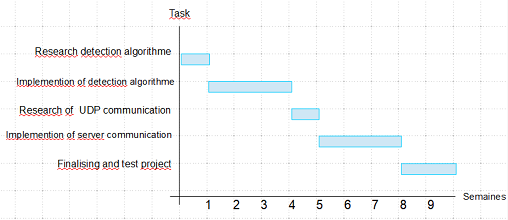

# Camera-De-Surveillance
Projet - Traitement de données &amp; Embarqué - N.Prieur

Concept:

Cette apllication web permet de detecter le mouvement à partir d'une caméra afin de faire de la surveillance. L'utilisateur est informé en cas de mouvement 
et il lui est possible d'accés aux images en temps réel. Il lui est aussi possible d'envoyer des bandes sonore pré-enregistré.
Le programme doit pouvoir fonctionner avec la caméra embarquée d'un ordinateur, une camera USB et avec la camera d'un téléphone.

Le scénario de ce programme est le suivant: 

Au lancement, le programme va envoyer 'start' pour indiquer qu'une caméra est online. Sur la page serveur, il est maintenant affiché online. 
La caméra s'allume, 10 sec plus tard (le temps de sortir du champ) l'agorithme de détéction se met en marche.
Si un mouvement est détécté, le programme envoie une image sur le serveur.
Si l'utilisateur clique sur l'image, le programme commence à envoyer le flux au serveur en UDP. 
Si l'utilisateur clique sur la vidéo, elle s'arrête et il est de nouveau affiché "online", le serveur envoie 'stop' au client.
Enfin, il y a sur la page serveur des boutons permettant, à n'importe quel moment, d'envoyer du son à diffuser coté client. 

Programme à implémenter:

La première étape du développement consistera en la mise en place d'un programme capable de détécter le mouvement.
Et la seconde à mettre en place la partie du code qui s'occupera de la communication avec le serveur.

comportement de l'algorithme de détéction de mouvement :

event = 'NULL'

#joue la piste sonore reçue

	def play_sound(piste): 

#compare les pixels d'une succession de capture afin de détécter le mouvement (méthode à définir)

	def frame_compare(frame_list): 	

#permet d'envoyer des requetes au serveur

	def send(): 

#permet de recevoir les requêtes du serveur

	def receive(): 

#stoque les dernières frames pour les comparaisons

	def update_stream(last_frame, frame_list): 
		liste = frame_list
		list.add(last_frame)
		if len(list) < size:
			list.remove() #retire le plus ancien
		return list

 #retourne true s'il un mouvement est détécté
 
	def moovement_trigger(frame_list, seuil):
		difference = frame_compare(frame_list)
		if difference > seuil:
			return True
		else:
			return False
		
		
#bloucle principale du programme

	def camera_surveillance(): 
		open_camera()
		send('start')
		while (True):
			list = update_stream()
			rcv = receive()
			if moovemet_trigger(list, seuil):
				send('snap:'+base64)
			if rcv == 'stream':
				send('stream:'+stream_data)
			if rcv == 'stop':
				stop_stream()
			if rcv == 'sound':
				play_sound(sound)

Modèle de données / Protocole :\

Lorsque le serveur reçoit "name: <name>" name est ajouté à la liste des cameras connecté.\
Lorsque l'on clique sur un nom de la liste, toutes actions sera faite sur cette dernière.  

Bouton Snapshot : Envoie  "snapshot" au client puis attend une image en base64, pour l'afficher à l'écran. "frame: <string>".  
Bouton Stream : Envoie "stream" au client puis attend un flux vidéo en binaire qui sera affiché à l'écran (1 octet par pixel, noir et blanc) 640*360. Le tout encodé en H.240.  
Bouton Stop : Envoie "stop" au client.  
Bouton Alarme : Envoie "alarm" au client.  

Dans la liste de cameras :
-Si le nom de la camera est verte cela veut dire qu'il y a eu une détection de mouvement et qu'une image du mouvement est disponible.
 Si le nom de la camera est gris c'est que la camera n'a toujours rien détecté.
-Si le serveur reçoit "detected" change la couleur du nom de la camera correspondante en vert dans la liste et enregistre une image en base64. "detected: <string>".
Bouton Mouvement : S'il y en a une, affiche l'image du mouvement correspondant à la camera. Le nom redevient gris.
Si un client ne répond pas, on le retire de la liste.

Lorsque le serveur reçoit "name: <name>" name est ajouté à la liste des cameras connecté.
Lorsque l'on clique sur un nom de la liste, toutes actions sera faite sur cette dernière.

Bouton Snapshot : Envoie  "snapshot" au client puis attend une image en base64, pour l'afficher à l'écran. "frame: <string>".
Bouton Stream : Envoie "stream" au client puis attend un flux vidéo en binaire qui sera affiché à l'écran (1 octet par pixel, noir et blanc) 640*360. Le tout encodé en H.240.
Bouton Stop : Envoie "stop" au client.
Bouton Alarme : Envoie "alarm" au client.

Dans la liste de cameras :
-Si le nom de la camera est verte cela veut dire qu'il y a eu une détection de mouvement et qu'une image du mouvement est disponible.
 Si le nom de la camera est gris c'est que la camera n'a toujours rien détecté.
-Si le serveur reçoit "detected" change la couleur du nom de la camera correspondante en vert dans la liste et enregistre une image en base64. "detected: <string>".
Bouton Mouvement : S'il y en a une, affiche l'image du mouvement correspondant à la camera. Le nom redevient gris.
Si un client ne répond pas, on le retire de la liste.

Diagramme de Gantt:

