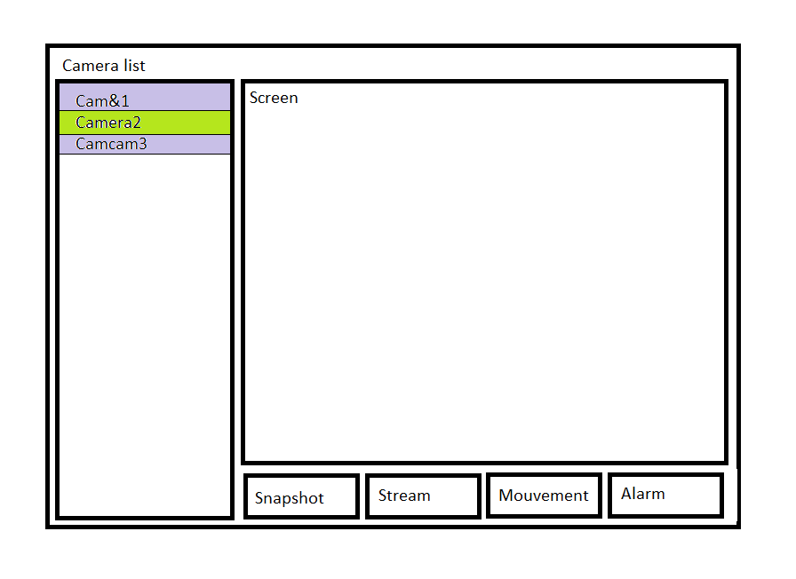

# Camera-De-Surveillance
Projet - Traitement de données &amp; Embarqué - N.Prieur

Concept:

Cette apllication web permet de detecter le mouvement à partir d'une caméra afin de faire de la surveillance. L'utilisateur est informé en cas de mouvement 
et il lui est possible d'accés aux images en temps réel. Il lui est aussi possible d'envoyer des bandes sonore pré-enregistré.
Le programme doit pouvoir fonctionner avec la caméra embarquée d'un ordinateur, une camera USB et avec la camera d'un téléphone.

Modèle de données / Protocole / scénario:  

Le serveur reçoit "projet: CameraDeSurveillance" pour indiquer le nom du projet.
Lorsque le serveur reçoit "name: <name>" name est ajouté à la liste des cameras connecté.  
Lorsque l'on clique sur un nom de la liste, toutes actions sera faite sur cette dernière.  

Bouton Snapshot : Envoie  "snapshot" au client puis attend une image en base64, pour l'afficher à l'écran. "frame: <string>".  
Bouton Stream : Envoie "stream" au client puis attend une succession d'image en base64 du stream, stream: "base64".
Bouton Alarme : Envoie "alarm" au client.  

Dans la liste de cameras :  
-Si le nom de la camera est vert cela veut dire qu'il y a eu une détection de mouvement et qu'une image du mouvement est disponible.  
-Si le nom de la camera est gris c'est que la camera n'a toujours rien détecté.  
-Si le serveur reçoit "detected" change la couleur du nom de la camera correspondante en vert dans la liste.
Bouton du nom en vert : Envoie "mouvement" au client puis attend "mouvement: <string>" contenant l'image du mouvement en base64 et l'affiche. Le nom redevient gris.  
Si un client ne répond pas, on le retire de la liste. 

Programme à implémenter:

La première étape du développement consistera en la mise en place d'un programme capable de détécter le mouvement.
Et la seconde à mettre en place la partie du code qui s'occupera de la communication avec le serveur.

comportement de l'algorithme de détéction de mouvement :

event = 'NULL'

#joue la piste sonore reçue

	def playSound(piste): 

#compare les pixels d'une succession de capture afin de détécter le mouvement (méthode à définir)

	def frameCompare(frameList): 	

#permet d'envoyer des requetes au serveur

	def send(): 

#permet de recevoir les requêtes du serveur

	def receive(): 

#stoque les dernières frames pour les comparaisons

	def updateStream(lastFrame, frameList): 
		liste = frameList
		list.add(lastFrame)
		if len(list) < size:
			list.remove() #retire le plus ancien
		return list

 #retourne true si un mouvement est détécté
 
	def moovementTrigger(frameList, seuil):
		difference = frameCompare(frameList)
		if difference > seuil:
			return True
		else:
			return False
		
		
#bloucle principale du programme

	def cameraSurveillance(): 
		openCamera()
		send('start')
		while (True):
			list = updateStream()
			rcv = receive()
			if moovemetTrigger(list, seuil):
				send('snap:'+base64)
			if rcv == 'stream':
				send('stream:'+streamData)
			if rcv == 'stop':
				stopStream()
			if rcv == 'sound':
				playSound(sound)
 

Visualization:

Diagramme de Gantt:

