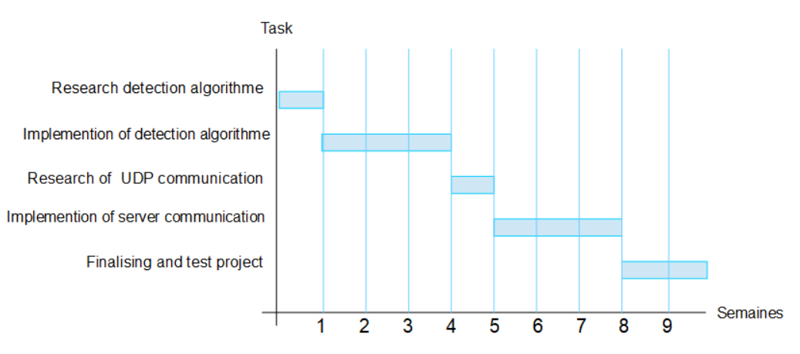

# Camera-De-Surveillance
Projet - Traitement de données &amp; Embarqué - N.Prieur

Concept:

Cette apllication web permet de detecter le mouvement à partir d'une caméra afin de faire de la surveillance. L'utilisateur est informé en cas de mouvement 
et il lui est possible d'accés aux images en temps réel. Il lui est aussi possible d'envoyer des bandes sonore pré-enregistré.
Le programme doit pouvoir fonctionner avec la caméra embarquée d'un ordinateur, une camera USB et avec la camera d'un téléphone.

Le scénario de ce programme est le suivant: 

Au lancement, le programme va envoyer 'start' pour indiquer qu'une caméra est online. Sur la page serveur, il est maintenant affiché online. 
La caméra s'allume, 10 sec plus tard (le temps de sortir du champ) l'agorithme de détéction se met en marche.
Si un mouvement est détécté, le programme envoie une image sur le serveur.
Si l'utilisateur clique sur l'image, le programme commence à envoyer le flux au serveur en UDP. 
Si l'utilisateur clique sur la vidéo, elle s'arrête et il est de nouveau affiché "online", le serveur envoie 'stop' au client.
Enfin, il y a sur la page serveur des boutons permettant, à n'importe quel moment, d'envoyer du son à diffuser coté client. 

Programme à implémenter:

La première étape du développement consistera en la mise en place d'un programme capable de détécter le mouvement.
Et la seconde à mettre en place la partie du code qui s'occupera de la communication avec le serveur.

comportement de l'algorithme de détéction de mouvement :

event = 'NULL'

def play_sound(piste): #joue la piste sonore reçue

def frame_compare(frame_list): #compare les pixels d'une succession de capture afin de détécter le mouvement (méthode à définir)

def send(): #permet d'envoyer des requetes au serveur

def receive(): #permet de recevoir les requêtes du serveur

def update_stream(last_frame, frame_list): #stoque les dernières frames pour les comparaisons
	liste = frame_list
	list.add(last_frame)
	if len(list) < size:
		list.remove() #retire le plus ancien
	return list

def moovement_trigger(frame_list, seuil): #retourne true s'il un mouvement est détécté
	difference = frame_compare(frame_list)
	if difference > seuil:
		return True
	else:
		return False
		

def camera_surveillance(): #bloucle principale du programme
	open_camera()
	send('start')
	while (True):
		list = update_stream()
		rcv = receive()
		if moovemet_trigger(list, seuil):
			send('snap:'+base64)
		if rcv == 'stream':
			send('stream:'+stream_data)
		if rcv == 'stop':
			stop_stream()
		if rcv == 'sound':
			play_sound(sound)

le modèle de données pour ce type de projet est le suivant:

Envoie un string contenant "start" au démarage
Envoie un string contenant "snap: <base64>" lors d'un mouvement.
Envoie un string contenant "stream: <base64>" lors ce que l'on demande le flux en directe.
Reçoie "stream" lorsque le client clique sur l'image d'un mouvement.	
Reçoie "stop" lorsque le client ferme le flux.
Reçoie "sound: piste" lorsque le client choisie d'envoyer un son. "piste" correspond au nom de la piste sonore choisie.

Diagramme de Gantt:

